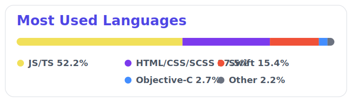

  

  
  
  
  

<h3 align="center">Building polished mobile products, strong developer experience, and bridges between native and cross-platform stacks.</h3>

  Based in Derby, UK. I work across iOS, React Native, native platform integration, and the tooling that keeps teams shipping.

---

## What I Build With 🏗️

  
  
  
  
  

  
  
  
  

## Focus Areas

- iOS engineering with `Swift`, `SwiftUI`, and native platform APIs
- Cross-platform product work with `React Native` and `Expo`
- Native bridge work across `Swift`, `Objective-C`, `Java`, `Kotlin`, and JavaScript runtimes
- Frontend and tooling work with `TypeScript`, `JavaScript`, `React`, and DX-focused automation
- Backend with `Node`, `TypeScript`, and various SaaS platforms

## Languages

*Language-based snapshot of byte-weighted usage across my public repositories on **March 30, 2026**.*

  

## Highlighted Work

- [`skills`](https://github.com/lmcjt37/skills) -> Curated AI Skills
- [`curated-tv-and-film`](https://github.com/lmcjt37/curated-tv-and-film) -> Maintained Hacktoberfest project
- [`cosmographer`](https://github.com/lmcjt37/cosmographer) -> Architecture driven data modelling and rendering.

## Reach Out

If you're building mobile products, improving DX, or trying to make native and cross-platform teams work better together, I’m always up for that conversation.
